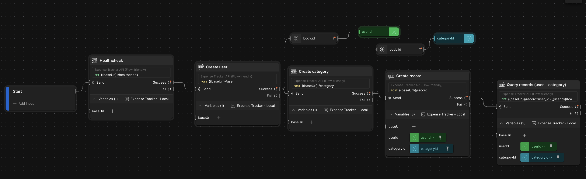
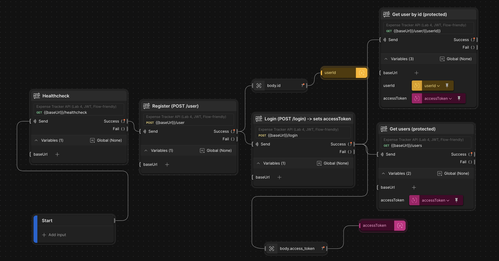

# Expense Tracker API

Навчальний REST API для обліку витрат (лабораторні роботи).  
Стек: Python + Flask + Flask-RESTful. Для ЛР4 — JWT авторизація.

## Функціонал (ЛР2)

- **User**
  - `POST /user` — створити користувача
  - `GET /user/<user_id>` — отримати користувача
  - `DELETE /user/<user_id>` — видалити користувача
  - `GET /users` — список користувачів

- **Category**
  - `POST /category` — створити категорію
  - `GET /category` — список категорій
  - `DELETE /category?category_id=<id>` — видалити категорію

- **Record**
  - `POST /record` — створити запис витрат
  - `GET /record/<record_id>` — отримати запис
  - `DELETE /record/<record_id>` — видалити запис
  - `GET /record?user_id=<id>&category_id=<id>` — фільтрація записів  
    > Якщо в `GET /record` немає `user_id` або `category_id` — повертається помилка (згідно методички).

## Скріншот Flow (ЛР2)

> Postman Flow, який демонструє створення user → category → record з використанням змінних.



## Функціонал (ЛР4) — JWT авторизація

У ЛР4 додається авторизація через JWT:
- `POST /user` — реєстрація (username/password), пароль зберігається як hash
- `POST /login` — логін, повертає `access_token`

Усі інші ендпоінти (users/category/record) захищені та потребують:
- Header: `Authorization: Bearer <token>`

### Налаштування JWT
Потрібна змінна середовища:
- `JWT_SECRET_KEY` — секрет для підпису токенів

Приклад запуску:
```bash
JWT_SECRET_KEY="change-me" docker compose up --build
```

### Postman (ЛР4)
1) Виконай `Login`
2) Збережи токен в `accessToken`
3) Виконуй запити з Bearer token

## Скріншот Flow (ЛР4)

> Postman Flow, який демонструє Register → Login → protected requests (Bearer token) та використання змінних `userId/categoryId/recordId`.



## Запуск

### Docker Compose
```bash
docker compose up --build
```

API буде доступний за адресою:
- `http://localhost:8000`

Healthcheck:
- `GET http://localhost:8000/healthcheck`

### Локально (venv)
```bash
python -m venv .venv
source .venv/bin/activate
pip install -r requirements.txt

python -m flask --app main.py run --host 0.0.0.0 --port 8000
```

## Postman

У папці `postman/` є:
- колекції запитів (ЛР2 / ЛР4)
- environment для `baseUrl`, а для ЛР4 також `accessToken`

Перед запуском (ЛР2):
1) Import collection
2) Import environment
3) Переконайся, що `baseUrl = http://localhost:8000`
4) Виконай `Create user` → `Create category` → `Create record`

Перед запуском (ЛР4):
1) Import collection (Lab 4)
2) Import environment
3) Виконай `Register` → `Login` (токен збережеться в `accessToken`)
4) Далі запускай будь-які protected запити

## Структура проєкту

- `main.py` — точка входу
- `app/` — ресурси/логіка
- `postman/` — колекції та environments
- `assets/` — зображення для звіту/README (`lab2.png`, `lab4.png`)
